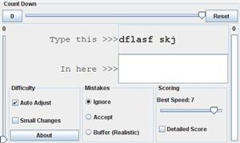

# typing-game-1
A typing tutorial / trainer (old Applet implementation ported to standard Java 8).  Look for a new version in an adjacent repository.

# Background
This program was initially created as a Java Applet in ~2006 to aid learning of new keyboard layouts.
Since then it has been converted to pure Java Swing. 

# Installation Instructions
* Checkout and 'package' the executable jar (on a machine with Maven and JDK8)
* Mark the resulting jar as executable (`chmod +x typing-game-1.0-SNAPSHOT.jar`)
* Double-click on the executable jar

Alternative keyboard layouts (listed in `src/main/java/tg/util/Util.java`) can be launched from the command line.  E.g.:
* `java -jar typing-game-1.0-SNAPSHOT.jar dvorak`
* `java -jar typing-game-1.0-SNAPSHOT.jar qwerty-letters-only`

# How to Use
The old manual (which is mostly relevant) can be found in `src/main/resources/manual/instructions.html` 